# MLOps Zoomcamp: Anemia Detection Project

Welcome to this MLOps project where we will dive into the anemia detection dataset from [Kaggle](https://www.kaggle.com/datasets/sayeemmohammed/anemia-detection/data). Our goal is to uncover interesting insights and potentially build a predictor for anemia based on the given data.

## 1. Problem description

Anemia is a pathological condition characterized by low red blood cell count or hemoglobin levels. It can result from various factors, including infections, oncological diseases, and other health issues1. Here are some key points about anemia and its prediction using AI:

1. **Prevalence of Anemia**:
   - Anemia affects a significant portion of the global population. Approximately 9.1%, 25.7%, and 42.8% of people worldwide have high, medium, and low-level anemia, respectively.
   - Two vulnerable groups are women of reproductive age (15–49 years) and children (up to 5 years old), with prevalence exceeding 50% and 70% in certain countries.
2. **Traditional Diagnosis**:
    - The initial step in diagnosing anemia involves a general blood test to assess erythrocyte levels, hemoglobin, color index, and hematocrit.
    - However, this invasive procedure can be uncomfortable for patients and healthcare workers, and it generates biohazardous waste.
3. **AI-Driven Solutions**:
    - Non-invasive procedures based on artificial intelligence (AI) algorithms are preferable.
    - Deep learning approaches have been used to diagnose anemia. These include intelligent algorithms that learn from data and make predictions.
    - Examples of deep learning techniques for anemia diagnosis include convolutional neural networks (CNNs) and artificial neural networks (ANNs).
4. **Predicting Anemia with AI**:
    - Machine learning (ML) models can predict anemia based on risk parameters such as age, sex, and medical history.
    - Supervised learning techniques like decision trees, logistic regression, and support vector machines (SVM) can be applied.
    - Researchers have explored using ML algorithms to identify iron-deficiency anemia, achieving promising results.

In summary, this project implements all the learned in the course. It creates a model workflow, tracks the experiments, registers the model, monitors, and applies best practices. Finally, the model is deployed and used in an AWS lambda that can be consumed by applications or directly with curl.

### Dataset

The dataset was found as a [Kaggle](https://www.kaggle.com/datasets/sayeemmohammed/anemia-detection/data) dataset. 
Sample data:

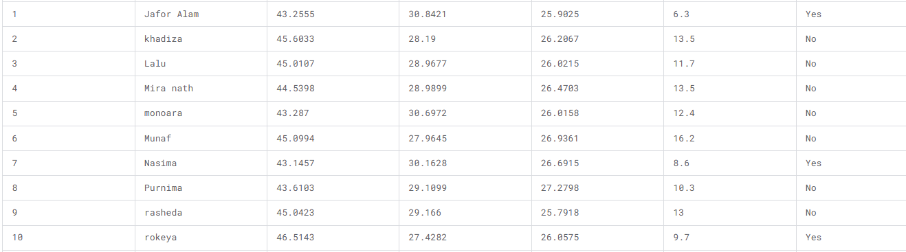

## Project directories

- **DATA**
    - It contains the dataset.
- **EDA**
    - It contains the files of data exploration.
- **Workflow**
    - It contains the Dockerfile for the mage-ai project, mlflow and evidently.
- **lambdas**
    - It contains the lambda service.
- **IaC**
    - It contains the terraform files for deploy the infrastructure on AWS. Also, how deploy the infrastructure.

`images` directory only contains the images for the markdown.

## Project Architecture

Below is a depicted description of the architecture used in this project.

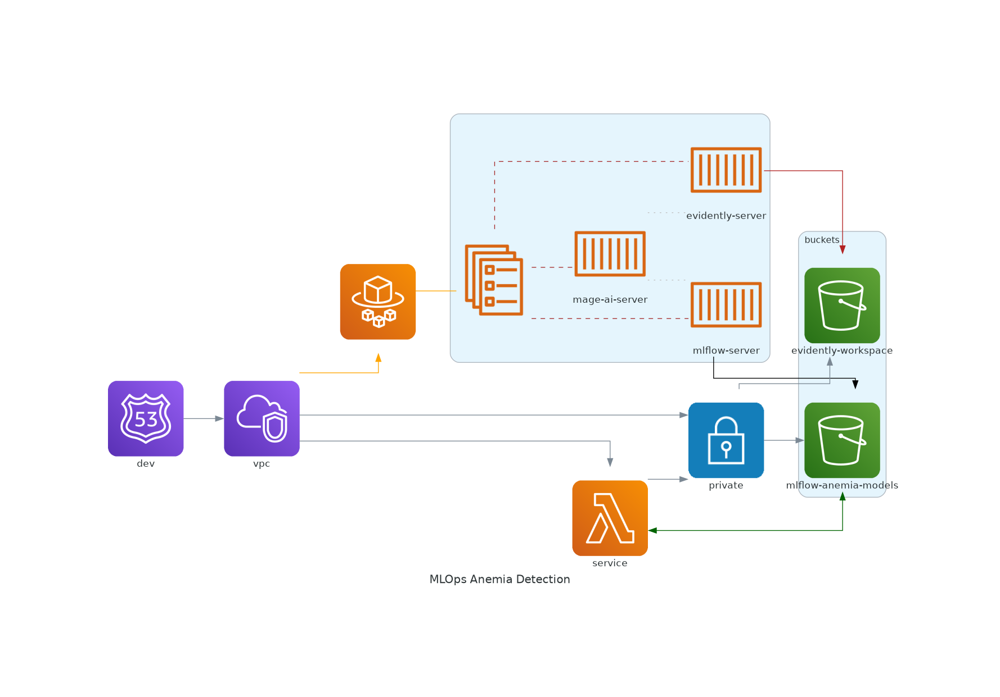

## Technology Utilized

The following tools are used in this project:

- **Cloud Provider** - [Amazon Web Services](https://aws.amazon.com)
    - **Storage** - [Amazon S3](https://aws.amazon.com/s3/)
    - **Serverless compute for containers** - [AWS Fargate](https://aws.amazon.com/fargate/)
- **Infrastructure as code (IaC)** - [Terraform](https://www.terraform.io/)
- **Workflow orchestration** - [Mage AI](https://www.mage.ai/)
- **Model deployment** - [Docker](https://www.docker.com/)
- **Experiment tracking and model registry** - [mlflow](https://mlflow.org/)
- **Model monitoring** - [Evidently AI](https://www.evidentlyai.com/)
- [Python](https://www.python.org/)

### Workflow orchestration

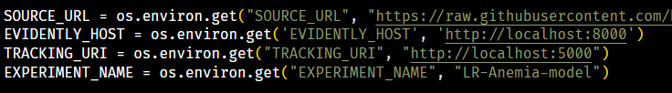
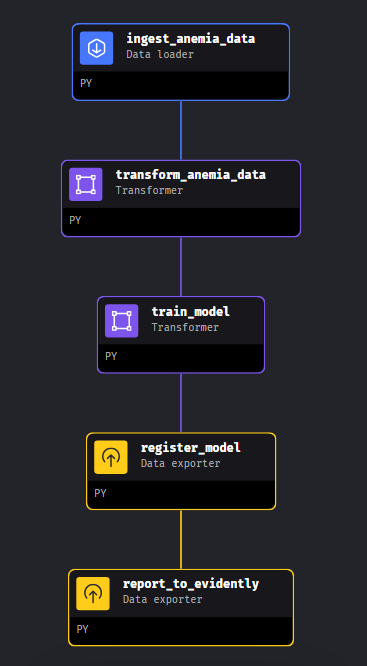
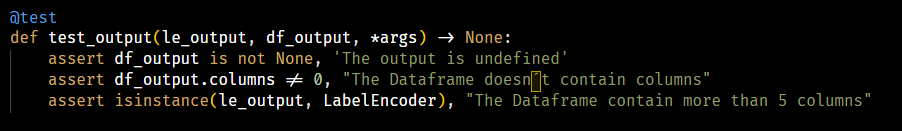
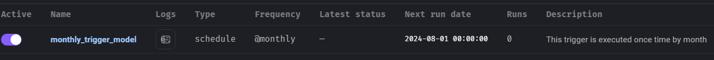

### Experiment tracking and model registry

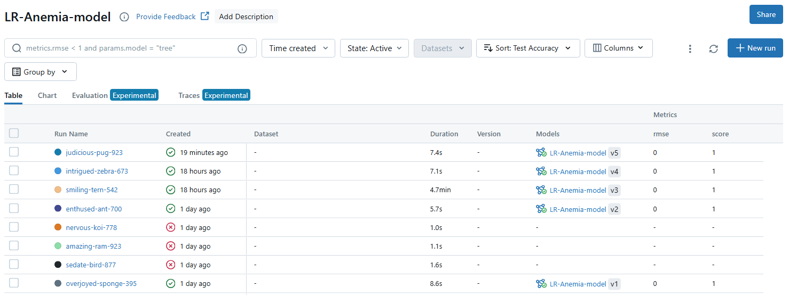
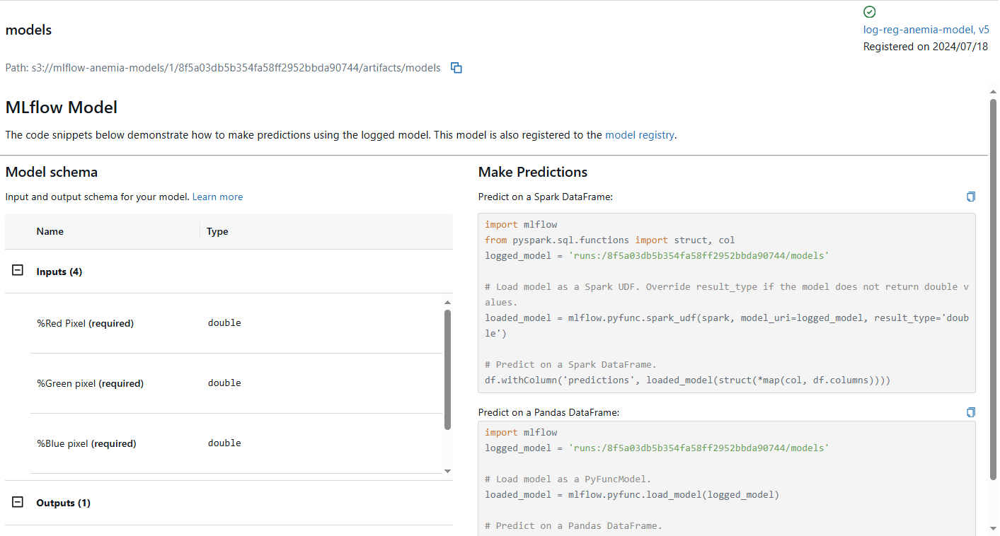
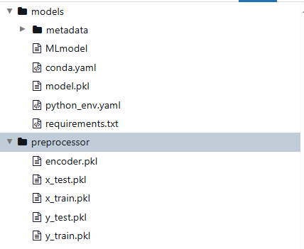
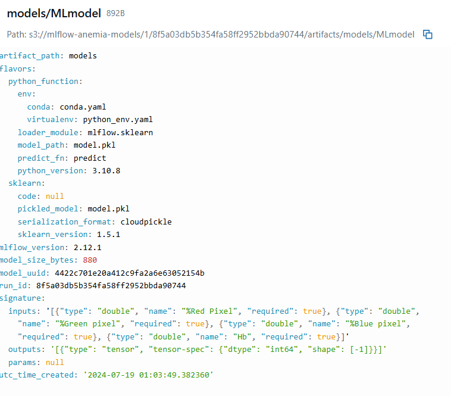

### Model monitoring

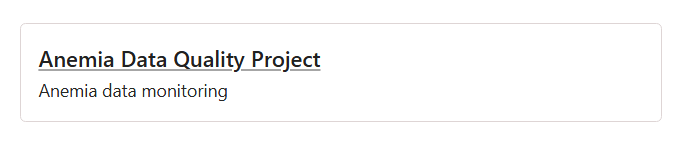
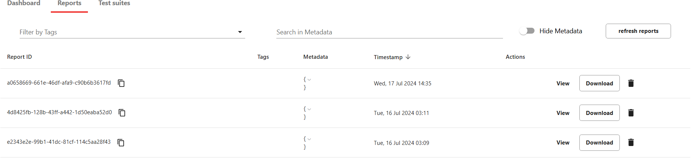
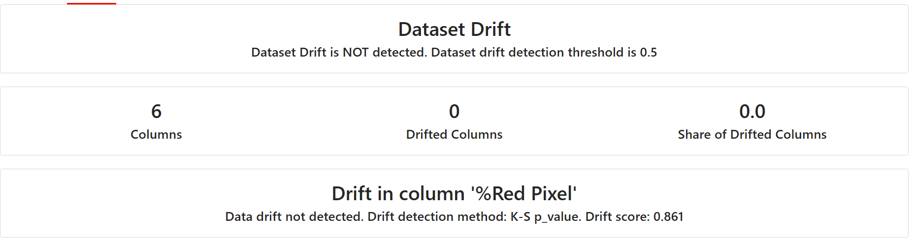

## Reproducibility

### Local

1. Run Makefile
2. Execute `make deploy_local`

### AWS

1. Cd `IaC`
2. Copy `sample.variables.tfvars` to `variables.tfvars`
3. Configure `variables.tfvars`
4. Configure you AWS Credentials with `aws configure`. (If you don´t have installed AWS CLI, you need install it with `pip install awscli`)
5. Run Makefile
6. Execute `make deploy_aws`